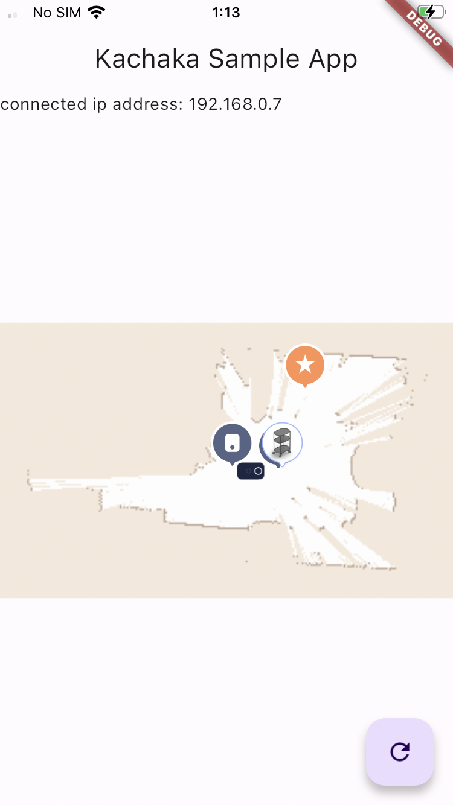

# kachaka_api_flutter_sample



## Usage

### Setup
Make sure you have Flutter installed on your local machine. For more instructions on how to install flutter, look [here](https://docs.flutter.dev/get-started/install).

```
git clone git@github.com:pf-robotics/kachaka-api-flutter.git
cd kachaka_api_flutter_sample
```

### iOS/Android
```
# Replace "xxx.xxx.xx.xx" with Kachaka's IP address
flutter run --dart-define=IP_ADDRESS="xxx.xxx.xx.xx"
```

### Web
Following [プロキシサーバ](https://github.com/pf-robotics/kachaka-api#%E3%83%97%E3%83%AD%E3%82%AD%E3%82%B7%E3%82%B5%E3%83%BC%E3%83%90), please set up a proxy server to use gRPC-web.

```
# If you set up the proxy server on localhost with port 50000,
flutter run --dart-define=IP_ADDRESS="localhost" --dart-define=PORT="50000"
```


Currently, iOS, Android and Web are supported. This app is verfied to work with Flutter version 3.13.2.

## Overview

The app consists of three main features:

- gRPC-based Connection to "Kachaka": This app establishes a connection to "Kachaka" using gRPC and synchronizes smartphone data through cursor-based polling.

- Map Display: It displays "Kachaka", furniture, and destinations on a map, providing a visual representation of these elements.

- Action Execution: Users can perform actions by tapping on pins on the map. This includes moving furniture and navigating to specific destinations.
